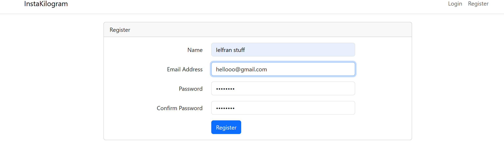
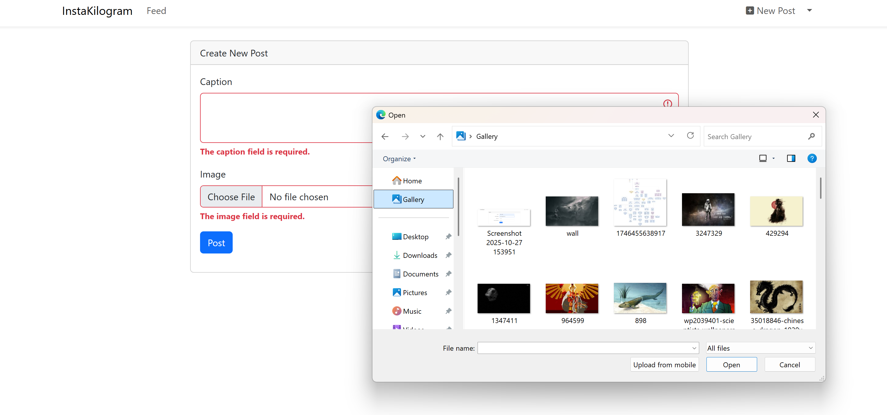

# 📸 InstaKilogram

**InstaKilogram** is an Instagram-clone built with **Laravel** and **MongoDB**.  
It allows users to upload pictures, interact with posts, and explore a dynamic feed — all through a simple, responsive interface.

---

## 🧩 Overview

InstaKilogram demonstrates how Laravel can be seamlessly integrated with MongoDB to create a fast and scalable full-stack web app.  
It focuses on simplicity, real-time interaction, and an intuitive user experience.

---

## 🚀 Technologies Used

- **Backend:** Laravel 12 (PHP 8.4)  
- **Database:** MongoDB  
- **Frontend:** Tailwind CSS, Bootstrap, Vite  
- **Tools:** Axios, Concurrently  
- **Session Management:** MongoDB-based storage  

---

## 🖼️ Screenshots

  
  

